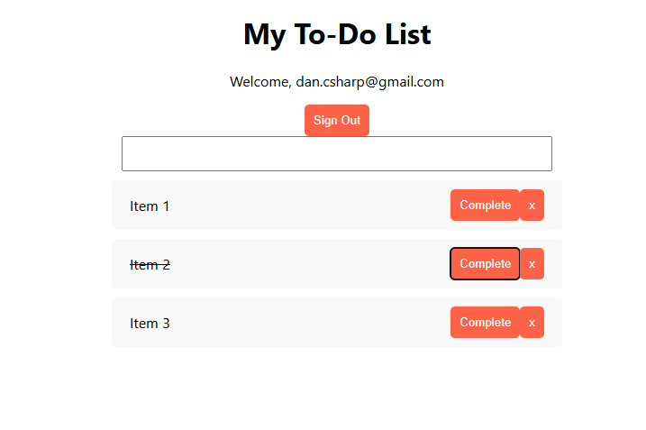

# to-do
A to-do list app (React + Node.js) with user authentication and data persistence

I'll be using Firebase for user authentication and data persistence. I looked into Appwrite but I won't be self-hosting this and am looking for simple. 

